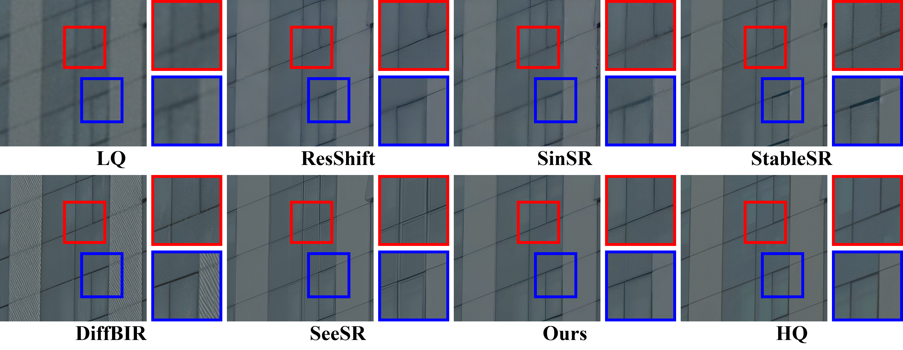

# ConsisSR: Improving Consistency in Diffusion Models for Image Super-Resolution
This repository contains the official implementation of the following paper:
> Improving Consistency in Diffusion Models for Image Super-Resolution <br>
> Junhao Gu <sup>1, 2∗†</sup>, Peng-Tao Jiang <sup>2∗‡</sup>, Hao Zhang <sup>2</sup>, Mi Zhou <sup>2</sup>, Jinwei Chen <sup>2</sup>, Ming-Wenming Yang <sup>1‡</sup>, Bo Li <sup>2</sup> <br><sup>1</sup>Tsinghua University  <br>
> <sup>2</sup>vivo Mobile Communication Co., Ltd <br>
> <sup>∗</sup>Equal contribution <br>
> <sup>†</sup>Intern at vivo Mobile Communication Co., Ltd <br>
> <sup>‡</sup>Corresponding author

[\[Paper\]](https://arxiv.org/abs/2410.13807)

## Abstract
Recent methods exploit the powerful text-to-image (T2I) diffusion models for real-world image super-resolution (Real-ISR) and achieve impressive results compared to previous models. However, we observe two kinds of inconsistencies in diffusion-based methods which hinder existing models from fully exploiting diffusion priors. The first is the semantic inconsistency arising from diffusion guidance. T2I generation focuses on semantic-level consistency with text prompts, while Real-ISR emphasizes pixel-level reconstruction from low-quality (LQ) images, necessitating more detailed semantic guidance from LQ inputs. The second is the training-inference inconsistency stemming from the DDPM, which improperly assumes high-quality (HQ) latent corrupted by Gaussian noise as denoising inputs for each timestep. To address these issues, we introduce ConsisSR to handle both semantic and training-inference consistencies. On the one hand, to address the semantic inconsistency, we proposed a Hybrid Prompt Adapter (HPA). Instead of text prompts with coarse-grained classification information, we leverage the more powerful CLIP image embeddings to explore additional color and texture guidance. On the other hand, we introduce Time-Aware Latent Augmentation (TALA) to bridge the training-inference inconsistency. Based on the probability function p(t), we accordingly enhance the SDSR training strategy. With LQ latent with Gaussian noise as inputs, our TALA not only focuses on diffusion noise but also refine the LQ latent towards the HQ counterpart. Our method demonstrates state-of-the-art performance among existing diffusion models. The code will be made publicly available.

<p align="center">  </p>

Visual Comparison:

<p align="center">  </p>

<p align="center">  </p>


## Installation

```bash
## git clone this repository
conda create -n ConsisSR python=3.10.16
pip install -r requirements.txt
```

## Inference
Please download the pretrained model from [Google Drive](https://drive.google.com/drive/folders/1ZaVwuh_fnjlbeILtNovNDVDHyZSQW_An?usp=drive_link) and put it into `logs/ConsisSR.ckpt`.

You can download `RealSR` and `DRealSR` from [StableSR](https://huggingface.co/datasets/Iceclear/StableSR-TestSets).

```bash
python inference.py \
--input [path to the testsets] \
--config configs/model/cldm.yaml \
--ckpt logs/ConsisSR.ckpt \
--output results \
--cfg_scale 5.0 \
--repeat_times 1
```

We use [BasicSR](https://github.com/XPixelGroup/BasicSR) to test PSNR and SSIM, and [pyiqa](https://github.com/chaofengc/IQA-PyTorch) to test LPIPS, NIQE, MUSIQ, MANIQA, and CLIPIQA. The settings for pyiqa are as follows:

```bash
lpips_metric = pyiqa.create_metric('lpips')
niqe_metric = pyiqa.create_metric('niqe')
musiq_metric = pyiqa.create_metric('musiq')
maniqa_metric = pyiqa.create_metric('maniqa-pipal')
clipiqa_metric = pyiqa.create_metric('clipiqa')
```

## Train

### Prepare training data

1. Download ImageNet-1k from [official website](https://www.image-net.org/download.php).
2. Prepare the file list.
```bash
python make_file_list.py
```
### Download the pretrained models

1. Download pretrained [Stable Diffusion v2.1](https://huggingface.co/stabilityai/stable-diffusion-2-1-base/blob/main/v2-1_512-ema-pruned.ckpt) and put it into `weights/stable_diffusion_2_1_base`.
2. Download pretrained [CLIP](https://huggingface.co/laion/CLIP-ViT-H-14-laion2B-s32B-b79K/blob/main/open_clip_pytorch_model.bin) and put it into `weights/laion2b_s32b_b79k`.

### Prepare the initial weights
```bash
python init_weight.py
```

### Train our HPA (stage 1)

Fill in [configuration file](https://github.com/Gujojo/ConsisSR/blob/main/configs/train_clip.yaml#L12) with the afore-mentioned initialized ckpt.

```bash
python train.py --config configs/train_clip.yaml
```

### Train our diffusion model (stage 2)

Fill in [configuration file](https://github.com/Gujojo/ConsisSR/blob/main/configs/train_clip.yaml#L13) with the well-trained ckpt from stage 1.

```bash
python train.py --config configs/train_cldm.yaml
```


## Citation

Please cite us if our work helps your research.
```bash
@misc{gu2024consissrdelvingdeepconsistency,
      title={Improving Consistency in Diffusion Models for Image Super-Resolution}, 
      author={Junhao Gu and Peng-Tao Jiang and Hao Zhang and Mi Zhou and Jinwei Chen and Wenming Yang and Bo Li},
      year={2024},
      eprint={2410.13807},
      archivePrefix={arXiv},
      primaryClass={cs.CV},
      url={https://arxiv.org/abs/2410.13807}, 
}
```

## License
This project is released under the Apache 2.0 license.

## Acknowledgement
This project is based on [BasicSR](https://github.com/XPixelGroup/BasicSR) and [DiffBIR](https://github.com/XPixelGroup/DiffBIR). Thanks for their awesome work.

## Contact
If you have any questions, please feel free to contact with me at gujh21@mails.tsinghua.edu.cn.

